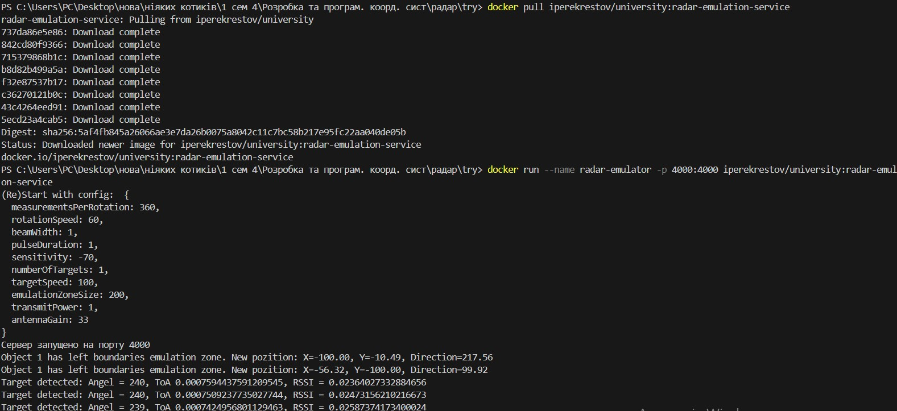

# Розробка додатку для візуалізації вимірювань радару

Мета роботи

Розробити додаток, який зчитує дані з емульованої вимірювальної частини радару, наданої у вигляді Docker image, та відображає задетектовані цілі на графіку в полярних координатах.

<h1>Завдання 1.	</h1>

