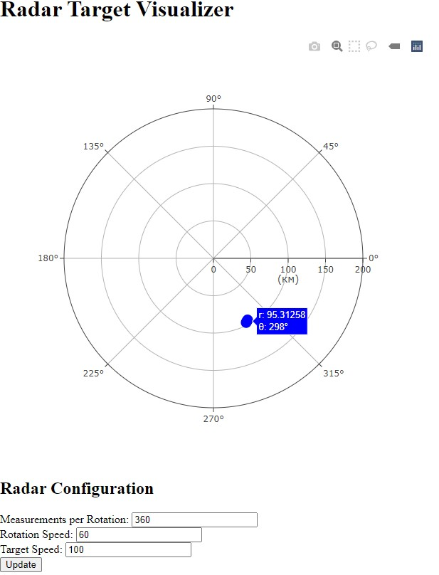
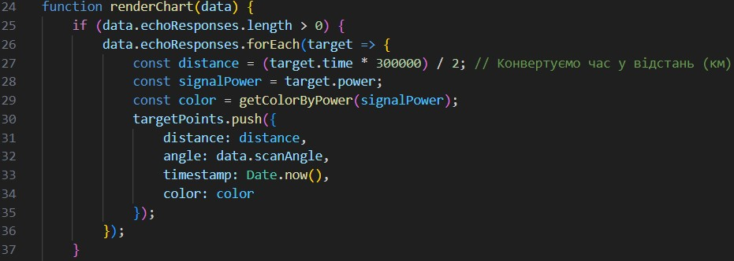
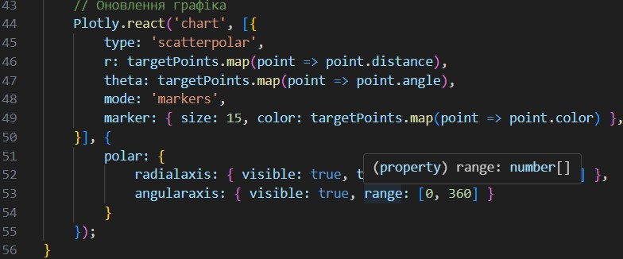
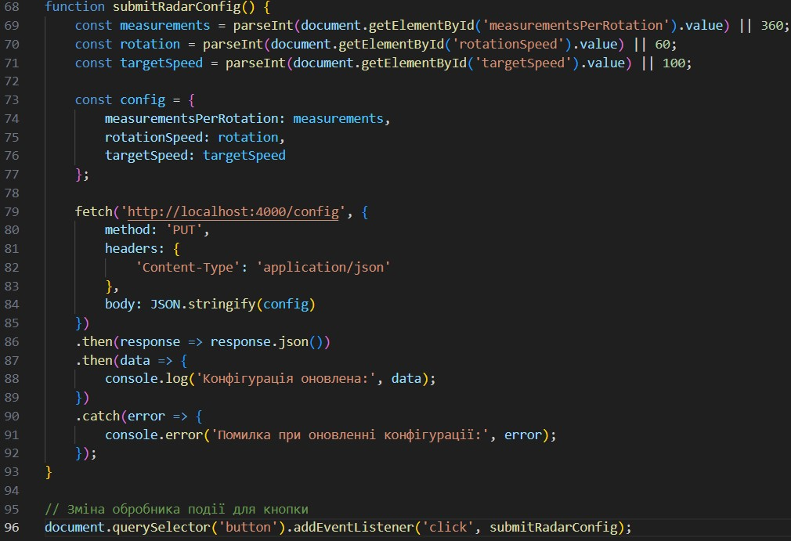

# Розробка додатку для візуалізації вимірювань радару

Мета роботи

Розробити додаток, який зчитує дані з емульованої вимірювальної частини радару, наданої у вигляді Docker image, та відображає задетектовані цілі на графіку в полярних координатах.

Завантаження та запуск емулятора вимірювальної частини радару:

Завантажуємо Docker image з Docker Hub і запускаємо Docker контейнер:

Ця команда запускає контейнер з ім'ям radar-emulator і відкриває порт 4000 для з'єднання з емульованою вимірювальною частиною радару.

Програма отримує інформацію про виявлені об'єкти з веб-сервера в режимі реального часу та відображає їх на спеціальній діаграмі.

Створюємо додаток для візуалізації цілей:

Кожна ціль відображається у вигляді точки на графіку з координатами (кут, відстань).

Ця функція займається обробкою даних, отриманих через WebSocket, і відповідає за оновлення графіка.

У ній перебираються echoResponses для обчислення відстані та кута кожної цілі, які зберігаються в масиві targetPoints

Цей виклик в renderChart оновлює графік, використовуючи бібліотеку Plotly.

Для кожної цілі передається радіус (відстань) і кут (кут) у полярних координатах, завдяки чому цілі відображаються на графіку.

Можливість зміни параметрів вимірювальної частини радара за допомогою API запитів.

submitRadarConfig():
Ця функція призначена для збору даних з форми та їх відправки на сервер для оновлення конфігурації радара.

Вона зчитує значення полів форми (кількість вимірювань за оберт, швидкість обертання та швидкість цілей), створює об'єкт конфігурації та надсилає його через HTTP-запит PUT.

Обробка події для кнопки:
Функція submitRadarConfig() прив'язується до кнопки оновлення за допомогою addEventListener, що дозволяє змінювати параметри після натискання кнопки користувачем.

